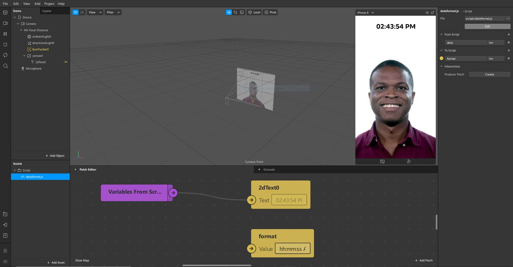

# sparkar-dateformat
> Patch script for date formatting for Spark AR Studio.

## Install
[Click here](https://github.com/nikolvs/sparkar-dateformat/archive/main.zip) to download the zip file, extract it and import `dateformat.js` as an asset for your Spark AR project.

## Usage
Below are the patch inputs/outputs you have to define for the script.

### From Script

#### `date`
* **Description**: Formatted date you receive from the script.
* **Type**: Text

### To Script

#### `format`
* **Description**: Set in which format pattern the date text will be generated.
* **Type**: Text
* **Optional**: `true`
* **Default**: `'YYYY-MM-DD HH:mm:ss'`

**Patterns**
| Input | Example | Description
| --- | --- | ---
| `YYYY` | `2021` | 4 digit year.
| `YY` | `21` | 2 digit year.
| `MM` | `02` | Month number from 01 to 12 (with leading zero).
| `M` | `2` | Month number from 1 to 12.
| `DD` | `09` | Day of month from 01 to 31 (with leading zero).
| `D` | `9` | Day of month from 1 to 31.
| `HH` | `06` | Hours (24 hour time) from 00 to 23 (with leading zero).
| `H` | `6` | Hours (24 hour time) from 0 to 23.
| `hh` | `03` | Hours (12 hour time) from 01 to 12 (with leading zero).
| `h` | `3` | Hours (12 hour time) from 1 to 12.
| `mm` | `04` | Minutes from 00 to 59 (with leading zero).
| `m` | `4` | Minutes from 0 to 59.
| `ss` | `07` | Seconds from 00 to 59 (with leading zero).
| `s` | `7` | Seconds from 0 to 59.
| `A` | `PM` | Post or ante meridiem in uppercase.
| `a` | `am` | Post or ante meridiem in lowercase.

#### `refreshInterval`
* **Description**: Interval in seconds in which the date text will be refreshed. 
* **Type**: Number
* **Optional**: `true`
* **Default**: `1`

#### `debug`
* **Description**: Display debug messages on console. 
* **Type**: Boolean
* **Optional**: `true`
* **Default**: `false`

## Credits
* [Josh Beckwith](https://github.com/positlabs) for making [spark-localtime](https://github.com/positlabs/spark-localtime), which inspired me to create this script. I originally planned to contribute to his repo, but since his script relied on the `toLocaleDateString` method and it doesn't seen to work on Spark AR Studio anymore, I just made my own script from scratch;
* [Taynara Lima](https://www.instagram.com/taynaragpyk/) for creating Instagram filters, which made me see the limitations of Spark AR Studio in relation to date formats and inspired me to help her.